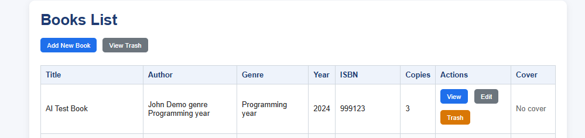
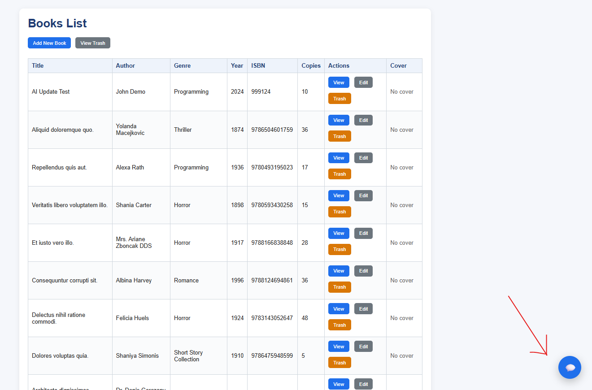
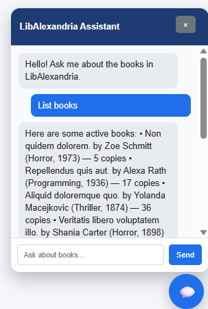
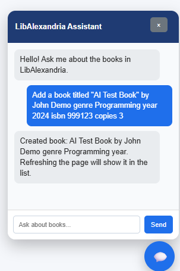
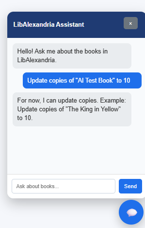
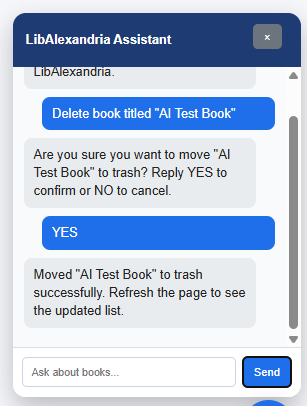
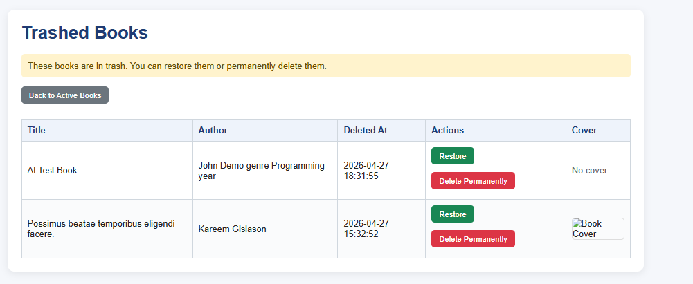

# 📚 LibAlexandria - Book Management System

LibAlexandria is a Laravel-based Book Management System enhanced with an AI chatbot assistant.  
This project is a fork/continuation of the Lab 2 MVC CRUD application and extends it with Google Gemini API integration for AI-assisted interaction with book records.

---

## 🚀 Project Overview

This application allows users to manage a collection of books through a traditional MVC interface and an AI-powered assistant.

The system supports:

- Manual CRUD operations through Laravel Blade pages
- Book cover image uploads
- Soft delete, restore, and permanent delete
- Database seeding with Faker
- Floating AI chatbot assistant
- AI-assisted book listing, filtering, creation, updating, and deletion

---

## 🚀 Features

### ✅ Core Features
- Create, Read, Update, Delete (CRUD) books
- View detailed book information
- Upload and display book cover images
- Clean and responsive UI

---

## 🤖 AI Chatbot Integration

The application includes a floating chatbot widget powered by the **Google Gemini API**.

### Chatbot Capabilities

The chatbot can answer general questions about the app, such as:

```text
What is this app?
```

It can also interact with the book database using natural language commands.

### Supported AI Commands

1. List books
```text
List books
```
2. Filter books by genre
```text
Show horror books
```
```text
Show programming books
```
```text
Show romance books
```
3. Filter books by copies
```text
Show books with more than 20 copies
```
```text
Show books with less than 10 copies
```
4. Filter books by year
```text
Show books published before 1950
```
```text
Show books published after 2000
```
5. Add a book using AI
```text
Add a book titled "AI Update Test" by John Demo genre Programming year 2024 isbn 999124 copies 3
```
6. Update book copies using AI
```text
Update copies of "AI Update Test" to 10
```
- The assistant asks for confirmation before applying the update.
```text
YES
```
7. Delete a book using AI
```text
Delete book titled "AI Update Test"
```
- The assistant asks for confirmation before moving the book to Trash.
```text
YES
```

### ⭐ Expanded Features (for higher grade)

#### 1. Soft Delete with Restore
- Books are not immediately deleted
- Moved to **Trash**
- Can be:
  - ♻️ Restored
  - ❌ Permanently deleted

#### 2. File Upload with Storage Management
- Upload cover images for books
- Images are stored in Laravel public storage
- Images are displayed in the active books list, detail page, edit page, and trash page
- Cover images are removed from storage when a book is permanently deleted

#### 3. Database Seeding with Faker
- Automatically generate sample books
- Uses Laravel Factory + Seeder
- Helps test UI and features quickly

### 4. AI Assistant for CRUD Operations
- The chatbot can perform selected CRUD operations through the Laravel backend:
  - Create books
  - Read/list books
  - Filter/search books
  - Update book copies
  - Soft delete books

- To prevent accidental changes, update and delete operations require confirmation.

---

## 🖼️ UI Features
- Modern card-based layout
- Styled tables and buttons
- Custom modal confirmations (no browser alerts)
- Responsive and centered layout

---

## 🛠️ Tech Stack

- **Framework:** Laravel 13
- **Language:** PHP 8.4
- **Database:** PostgreSQL
- **Frontend:** Blade + CSS + Javascript
- **AI Service:** Google Gemini API
- **Tools:** Composer, Artisan CLI, GitHub Desktop

---

## ⚙️ Installation Guide

### 1. Clone the repository
```bash
git clone https://github.com/YOUR_USERNAME/YOUR_REPO_NAME.git
cd YOUR_REPO_NAME
```

### 2. Install dependencies
```bash
composer install
```
### 3. Setup environment (`.env` file)
For Windows CMD:
```bash
copy .env.example .env
```
OR For Git Bash / macOS / Linux:

```bash
cp .env.example .env
```

### 4. Generate the Laravel app key
```bash
php artisan key:generate
```
### 5. Configure database

#### Create a PostgreSQL database first. Example:

```sql
CREATE DATABASE libalexandria;
```

#### Then Update `.env`:
```
DB_CONNECTION=pgsql
DB_HOST=127.0.0.1
DB_PORT=5432
DB_DATABASE=LibAlexandria
DB_USERNAME=postgres
DB_PASSWORD=your_password
```
### 6. Configure Gemini API

#### Get an API key from Google AI Studio (connected to your project), then add it to `.env`:
```
GEMINI_API_KEY=your_actual_gemini_api_key
GEMINI_MODEL=gemini-2.5-flash
```
#### DO NOT place the actual API key in `.env.example`.

### 7. Run migrations
```bash
php artisan migrate
```

### 8. Seed database (optional but recommended)
```bash
php artisan db:seed --class=BookSeeder
```

### 9. Create storage link

```bash
php artisan storage:link
```

### 10. Run the server
```bash
php artisan serve
```

- Open in browser by copying this link displayed on the CMD window:
```
http://127.0.0.1:8000/books
```

### Local SSL Note for Gemini API

#### On some Windows setups, Laravel/PHP may fail to call Gemini because of a local SSL certificate issue:
```
cURL error 60: SSL certificate problem
```
#### For local development, the app may use Laravel HTTP client’s SSL verification bypass:

```php
Http::withoutVerifying()
```
#### This is only for local testing.
#### For production, configure PHP with a proper CA certificate file instead.

---

## 🧠 How the AI Integration Works

The chatbot follows this flow:

```
User message
    ↓
Floating chatbot widget
    ↓
POST /chat route
    ↓
ChatController
    ↓
Book database query or Gemini API request
    ↓
JSON response
    ↓
Chatbot displays reply

```

The frontend does not call Gemini directly.
All AI requests are handled through the Laravel backend to keep the API key secure.

---

## 🔐 Security Notes

### API Key Protection

The Gemini API key is stored in the local `.env` file:

```
GEMINI_API_KEY=your_actual_api_key_here
GEMINI_MODEL=gemini-2.5-flash
```
The actual key must not be committed to GitHub.

The `.env.example` file should only contain:

```
GEMINI_API_KEY=
GEMINI_MODEL=gemini-2.5-flash

```

### CSRF Protection

The chatbot uses Laravel CSRF protection when sending requests to the `/chat` endpoint.

### Confirmation for Destructive Actions

The chatbot requires confirmation before:
  - Updating book copies
  - Moving a book to Trash

---

## 📂 Project Structure (Important Files)

```
app/
 └── Models/
      └── Book.php

app/Http/Controllers/
 └── BookController.php

database/
 ├── factories/
 │    └── BookFactory.php
 └── seeders/
      └── BookSeeder.php

resources/views/
 ├── layouts/
 │    └── app.blade.php
 └── books/
      ├── index.blade.php
      ├── create.blade.php
      ├── edit.blade.php
      ├── show.blade.php
      ├── trashed.blade.php
      └── form.blade.php

routes/
 └── web.php
```

---

## 🔄 System Flow
### 📘 Book Management

```
Add → Edit → View → Delete (soft delete)
```

### 🗑️ Trash System
- Deleted books go to Trash
- Options:
1. Restore book
2. Permanently delete

### 🧪 Testing Features

You can test:

#### Test regular CRUD

- Adding books with/without cover
- Editing book details
- Soft deleting books
- Restoring from Trash
- Permanent deletion
- Faker-generated data

#### Test the AI Assistant
Open the chatbot in the bottom-right corner and try:
```
What is this app?
```
```
List books
```
```
Show horror books
```
```
Show books with more than 20 copies
```
```
Show books published before 1950
```
```
Add a book titled "AI Update Test" by John Demo genre Programming year 2024 isbn 999124 copies 3
```
```
Update copies of "AI Update Test" to 10
```
 - Then confirm:
 ```
 YES
 ```

```
Delete book titled "AI Update Test"
```
 - Then confirm:
 ```
 YES
 ```

---

## 📸 Demo Screenshots / Videos

### Books List


### Floating AI Assistant


### AI List Books


### AI Add Book


### AI Update Book


### AI Delete Book


### Viewing Trash


---

## 🧩 System Design Summary

### MVC Implementation
 - Model: `Book.php` handles book data and database interaction through Eloquent ORM
 - View: Blade templates display pages, forms, book lists, and chatbot UI
 - Controller: `BookController.php` handles book CRUD logic, while `ChatController.php` handles AI assistant requests

### AI Assistant Design
The AI assistant uses a hybrid approach:
 - Rule-based parsing for safer CRUD operations
 - Gemini API for natural language responses and app explanation
 - Laravel backend as the secure bridge between frontend and AI service

---

## 📌 Notes
- Soft deletes use Laravel’s built-in SoftDeletes
- File uploads stored in storage/app/public
- Run this if images don’t show:
```
php artisan storage:link
```

---

## 👨‍💻 Author

Avillanosa, WK
CMSC129 – Laboratory 2

---

